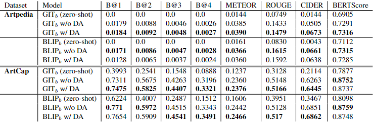

# Diffusion Based Augmentation for captioning and retrieval in Cultural Heritage

[](https://iccv2023.thecvf.com)
[](http://arxiv.org/abs/2308.07151)
[]([https://openaccess.thecvf.com/content/ICCV2023/papers/Liu_Multi-Modal_Neural_Radiance_Field_for_Monocular_Dense_SLAM_with_a_ICCV_2023_paper.pdf](https://openaccess.thecvf.com/content/ICCV2023W/e-Heritage/papers/Cioni_Diffusion_Based_Augmentation_for_Captioning_and_Retrieval_in_Cultural_Heritage_ICCVW_2023_paper.pdf))
[](#)
[](#)

This is the official repository for the ICCV 2023 4th Workshop on e-Heritage paper: **[Diffusion Based Augmentation for captioning and retrieval in Cultural Heritage](http://arxiv.org/abs/2308.07151)** Dario Cioni, Lorenzo Berlincioni, Federico Becattini, Alberto del Bimbo


If you find our work useful, we welcome citations:

```bibtex
@InProceedings{Cioni_2023_ICCV,
    author    = {Cioni, Dario and Berlincioni, Lorenzo and Becattini, Federico and Del Bimbo, Alberto},
    title     = {Diffusion Based Augmentation for Captioning and Retrieval in Cultural Heritage},
    booktitle = {Proceedings of the IEEE/CVF International Conference on Computer Vision (ICCV) Workshops},
    month     = {October},
    year      = {2023},
    pages     = {1707-1716}
}
```

## Table of Contents
<!-- TOC -->
* [Project Structure](#project-structure)
* [Data](#data)
* [Installation](#installation)
* [Usage](#usage)
  * [Configuration](#configuration)
  * [Train](#train)
  * [Test](#test)
* [Results](#results)
* [TODOs](#todos)
<!-- TOC -->

## Project Structure
Here is the description of the main files and folders of the project.

```
  cultural-heritage-image2text/
  │
  ├── main.py - main script for training and testing models
  │
  ├── data_loader/ - anything about data loading goes here
  │   └── artpedia.py contains Artpedia Dataset and DataModule
  │
  ├── data/ - default directory for storing input data
  │
  ├── model/ - models and metrics
  │   ├── model.py - LightningModule wrapper for image captioning
  │   └── metrics/ directory with custom metrics
  │
  ├── runs/
  │   ├── cultural-heritage/ - trained models are saved here
  │   └── wandb/ - local logdir for wandb and logging output
  │
  └── utils/
      ├── utils.py - small utility functions for training
      └── download.py - utility to download images from Artpedia json metadata
 ```

## Data
Experiments were performed on the [Artpedia](https://iris.unimore.it/retrieve/handle/11380/1178736/224456/paper.pdf) and [ArtCap]() datasets. Images were downloaded from Wikipedia using the [download.py](download.py) script.
To download the images, run the following command, providing a valid identifier, the annotation file and the output directory.

```bash
python utils/download.py email@domain.com --ann_file data/artpedia/artpedia.json --img_dir data/artpedia/images 
```

## Installation

This project uses a modified version of [pycocoevalcap](https://github.com/salaniz/pycocoevalcap). To install it, run the following command:

```bash
git submodule add --init
git submodule update --remote
cd pycocoevalcap
pip install -e .
```

## Usage
Command line interface is implemented using [LightningCLI](https://lightning.ai/docs/pytorch/stable/api/lightning.pytorch.cli.LightningCLI.html).

### Configuration
The setup during training and validation is controlled by a configuration file. 
The configuration file is a YAML file with the following structure:

```yaml
# lightning.pytorch==2.0.1.post0
seed_everything: int | bool
trainer:
  # list of trainer args
  logger:
    class_path: lightning.pytorch.loggers.WandbLogger
    init_args:
      # wandb logging args
  callbacks:
    class_path: callbacks.predictions.LogPredictionSamplesCallback
model:
  model_name_or_path: microsoft/git-base
  learning_rate: 5.0e-05
  warmup_steps: 500
  weight_decay: 0.0
  metrics:
    # add or remove metrics here
    - class_path: model.CocoScore
    - class_path: torchmetrics.text.BERTScore
      init_args:
        model_name_or_path: distilbert-base-uncased
        batch_size: 16
        lang: en
        max_length: 512
  generation:
    # generation args
data:
  img_dir: data/artpedia/
  ann_file: data/artpedia/artpedia_augmented.json
  batch_size: 2
  # Processor name for model
  model_name_or_path: microsoft/git-base
  num_workers: 6
ckpt_path: null # provide a path to a checkpoint to load
```

Every configuration can be overridden by passing a command line argument with the same name. For example, to override the `batch_size` parameter, you can run:

```bash
python main.py fit --config configs/config.yaml --data.batch_size 32
```

You can find a complete example of a configuration file in [configs/](configs/) folder.

### Dataset augmentation
The dataset augmentation is performed using the [img2img.py](utils/img2img.py) script. The script uses the [Automatic1111 API](https://github.com/AUTOMATIC1111/stable-diffusion-webui). To use the script, you need to provide an URL to the API. The script takes as input the path to the dataset annotation file, the path to the original dataset images and the output path for the augmented dataset. 

For each image in the dataset, the script generates a new folder with the same name as the image, containing augmented images.

```bash
python img2img.py --api_url http://127.0.0.1:7860 --ann_file data/artpedia/artpedia.json --img_dir data/artpedia/images --out_dir data/artpedia/samples
```

### Train
Training is performed using the `fit` subcommand, followed by the path to the configuration file and other optional arguments.

```bash
python main.py fit -c configs/your_config.yaml
```

### Test
Test is performed using the `test` command, followed by the path to the configuration file and other optional arguments.
```bash
python main.py test -c configs/config.yaml --ckpt_path path/to/ckpt.ckpt
```

## Results

Here are the performance of the pretrained models on the Artpedia and ArtCap dataset. For additional results, please refer to the paper.


