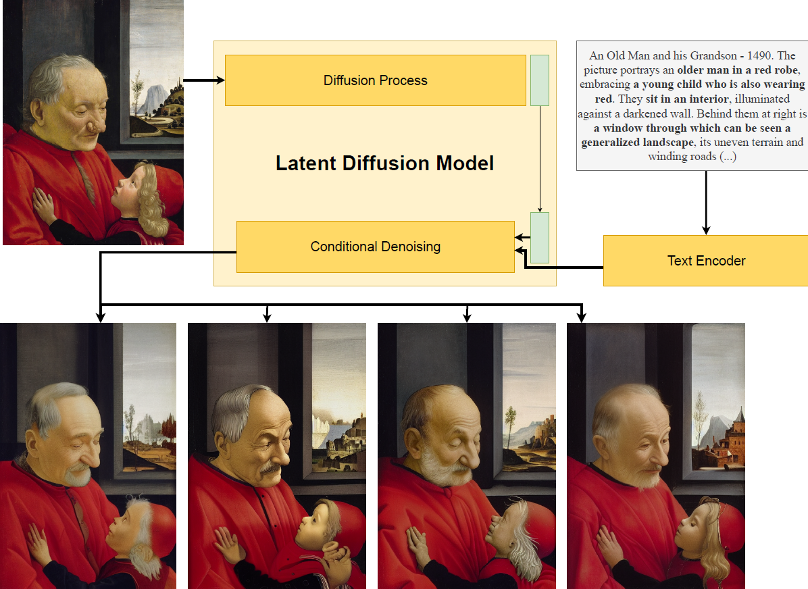

# Diffusion Based Augmentation for captioning and retrieval in Cultural Heritage

<!-- [](#) -->
[](#)
[](#)

This is the official repository for the ICCV 2023 4th Workshop on e-Heritage paper: **[Diffusion Based Augmentation for captioning and retrieval in Cultural Heritage](#)**



<!-- TOC -->
* [Diffusion Based Augmentation for captioning and retrieval in Cultural Heritage](#diffusion-based-augmentation-for-captioning-and-retrieval-in-cultural-heritage)
  * [Project Structure](#project-structure)
  * [Data](#data)
  * [Installation](#installation)
  * [Usage](#usage)
    * [Configuration](#configuration)
    * [Train](#train)
    * [Test](#test)
  * [Results](#results)
  * [TODOs](#todos)
<!-- TOC -->

## Project Structure
Here is the description of the main files and folders of the project.

```
  cultural-heritage-image2text/
  │
  ├── main.py - main script for training and testing models
  │
  ├── data_loader/ - anything about data loading goes here
  │   └── artpedia.py contains Artpedia Dataset and DataModule
  │
  ├── data/ - default directory for storing input data
  │
  ├── model/ - models and metrics
  │   ├── model.py - LightningModule wrapper for image captioning
  │   └── metrics/ directory with custom metrics
  │
  ├── runs/
  │   ├── cultural-heritage/ - trained models are saved here
  │   └── wandb/ - local logdir for wandb and logging output
  │
  └── utils/
      ├── utils.py - small utility functions for training
      └── download.py - utility to download images from Artpedia json metadata
 ```

## Data
Experiments were performed on the Artpedia [[1](https://iris.unimore.it/retrieve/handle/11380/1178736/224456/paper.pdf)] dataset. Images were downloaded from Wikipedia using the [download.py](download.py) script.
To download the images, run the following command, providing a valid identifier.

```bash
python utils/download.py email@domain.com --ann_file data/artpedia/artpedia.json --img_dir data/artpedia/images 
```

## Installation

This project a modified version of pycocoevalcap. To install it, run the following command:

```bash
git submodule add --init
git submodule update --remote
cd pycocoevalcap
pip install -e .
```

## Usage
Command line interface is implemented using [LightningCLI](https://lightning.ai/docs/pytorch/stable/api/lightning.pytorch.cli.LightningCLI.html).

### Configuration
The setup during training and validation is controlled by a configuration file. 
The configuration file is a YAML file with the following structure:

```yaml
# lightning.pytorch==2.0.1.post0
seed_everything: int | bool
trainer:
  # list of trainer args
  logger:
    class_path: lightning.pytorch.loggers.WandbLogger
    init_args:
      # wandb logging args
  callbacks:
    class_path: callbacks.predictions.LogPredictionSamplesCallback
model:
  model_name_or_path: microsoft/git-base
  learning_rate: 5.0e-05
  warmup_steps: 500
  weight_decay: 0.0
  metrics:
    # add or remove metrics here
    - class_path: model.CocoScore
    - class_path: torchmetrics.text.BERTScore
      init_args:
        model_name_or_path: distilbert-base-uncased
        batch_size: 16
        lang: en
        max_length: 512
  generation:
    # generation args
data:
  img_dir: data/artpedia/
  ann_file: data/artpedia/artpedia_augmented.json
  batch_size: 2
  # Processor name for model
  model_name_or_path: microsoft/git-base
  num_workers: 6
ckpt_path: null # provide a path to a checkpoint to load
```

Every configuration can be overridden by passing a command line argument with the same name. For example, to override the `batch_size` parameter, you can run:

```bash
python main.py fit --config configs/config.yaml --data.batch_size 32
```

You can find a complete example of a configuration file in [configs/](configs/) folder.

### Train
Training is performed using the `fit` subcommand, followed by the path to the configuration file and other optional arguments.

```bash
python main.py fit -c configs/your_config.yaml
```

### Test
Test is performed using the `test` command, followed by the path to the configuration file and other optional arguments.
```bash
python main.py test -c configs/config.yaml --ckpt_path path/to/ckpt.ckpt
```

## Results

Here are the performance of the pretrained models on the Artpedia and ArtCap dataset. For additional results, please refer to the paper.


## TODOs
- [x] Train on Artpedia
- [x] Add BLEU, METEOR, ROUGE-L, CIDEr
- [x] Handle validation loss calculation during generation
- [x] Support BLIP
- [x] Evaluate on other art datasets (ArtCap)